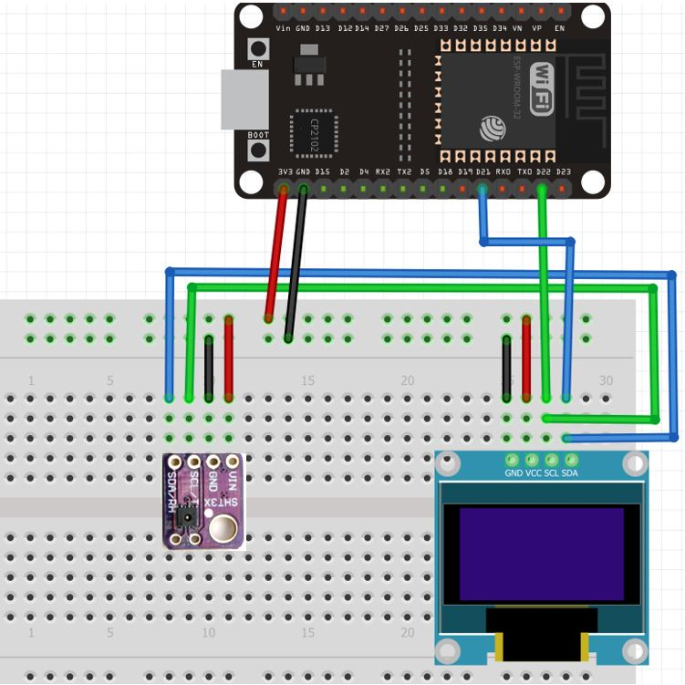
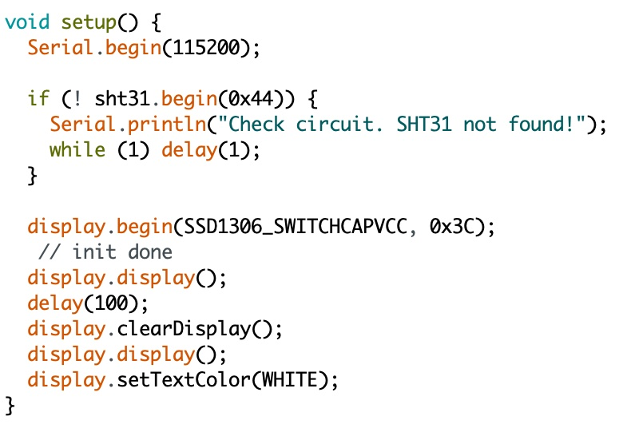

# Indoor Air Quality Sensor
As part of my EECE 321 Embedded Systems class at Manhattan College, I was assigned to construct an Indoor Air and Quality Sensor as my end-of-semester project. For this project, I had to use an ESP32 microcontroller and had to display the results on an OLED screen. Although there are many softwares, I used the Arduino IDE as my programming environment to complete my project. This was a quick and straightforward project, that one could try to do at home. The parts needed are: 
## 1. ESP32
The ESP 32 is a very powerful microcontroller. It contains a dual-core CPU that can be clocked at 80, 160 or 240MHz. It also has a Ultra Low Power Co-processor, and this is a much slower processor can be used to perform small tasks while the big dual-core CPU is in a sleep-mode. It includes 512KB of on-chip SRAM memory, used for data and program instructions. Besides this, it has an external memory and depending on your board, that might be as much as 4 to 8MB. Although not necessary in this project, the ESP32 has built-in WiFi and Bluetooth. So no need for additional radio modules, like you would see on most Arduino boards. The ESP32 is just one chip, with everything in 1 package. It also supports all of the Arduino libraries and is fairly inexpensive. 
## 2. SHT31 Sensor 
The SHT31 temperature and sensor module comes in a compact user-friendly size that features the SHT31 chip from Sensirion. This chip is in fact the temperature and humidity sensor that offers various functions, interfaces and extremely easy to use with a microcontroller. The sensor is able to measure temperature readings in the range of -40 to 125°C with a good accuracy of ±0.2°C. Similarly, the SHT32 chip also offers a humidity sensor which offers an operating humidity range of 0-100% with a typical relative humidity accuracy of 2%. Due to its small size, low cost, and wide operating voltage range of 2.15-5.5V, the SHT31 sensor is a great choice to be used with microcontrollers for temperature and humidity measurements e.g. thermostats, weather stations, etc.

The SHT31 Sensor Module uses I2C communication protocol to transmit sensor data to the microcontroller. The sensor module features the SCL (serial clock) and SDA (serial data) pins which connect with the I2C interface of ESP32 or other sensors supporting the same interface
## 3. 0.96 SSD1306 OLED Display
The OLED display I used was a HiLetgo 0.96" SSD1306 I2C IIC SPI Serial 128X64 OLED LCD Display 4 Pin Font Color Yellow Blue. In all honesty, I intended to get the white display, however, in an ordering mixup, I received the yellow-blue display. Just like the sensor, the screen also comes with 4 pins, I/O Voltage, SDA, and SCL pins.
## 4. Jumper Wires
To connect everything together, i used different colored jumper wires. Black and red to connect ground and!
 input voltage respectively, as well as blue and green wires to connect the respective SCL and SDA pins. You can use whatever colors you prefer, however, make sure to be consistent to avoid any mistakes in the circuit set up. 

## Setting up the circuit: 
Once I received all the parts, I started putting together the physical circuit. I decided to do this first because I really enjoy putting puzzles together and this really felt like one. I connected everything just like in the diagram below:

Once I finished with this, I started with writing the code. 

# Writing the Code On Arduino IDE:
## Downloading the ESP32 Plugin:
Because we are working in the Arduino IDE and the ESP 32 board, we need to add the ESP32 plugin. To do this, check the follwing steps: 
1. Go to Files > Preferences, and then paste this link in the "Additional Board Manager URL" https://dl.espressif.com/dl/package_esp32_index.json
2. Click Ok/Apply
3. Then go to Tools > Boards Manager. In the lookup box search for "ESP32" by Espressif. Click install and once it is installed click Ok/Apply. Your ESP32 Dev Module board should be ready to use. 

## Downloading the right libraries:
Once my board was recognized, it was time to install the following libraries: 

1. Adafruit SHT31
2. Adafruit BusIO
3. Adafruit SSD1306

Open your Arduino IDE and go to Sketch > Include Libraries > Manage Libraries. Type Adafruit SHT31 in the search bar and install the latest version. Type Adafruit BusIO in the search bar and install it as well. To use the OLED display in our project, we have to install the Adafruit SSD 1306 library in Arduino IDE. Follow the steps below to successfully install it. Open Arduino IDE and click on Sketch > Library > Manage Libraries. Type ‘SSD1306’ in the search tab and install the Adafruit SSD1306 OLED library.
## Header Files: 
We will first include all the required libraries for the SHT31 sensor as well as the OLED display which we just installed before.

#include <Arduino.h>

#include <Wire.h>

#include "Adafruit_SHT31.h"

#include <Adafruit_GFX.h>

#include <Adafruit_SSD1306.h>

Now, we will create another object named ‘display’ which will be handling the OLED display. Also, define the size of the OLED display by passing arguments to the Adafruit_SSD1306() function.

Adafruit_SSD1306 display = Adafruit_SSD1306(128, 64, &Wire, -1);

Initialize the OLED display by calling the begin() method on the display object.

display.begin(SSD1306_SWITCHCAPVCC, 0x3C); 
## Setting Up The OLED Screen
For this one, we first add the following lines of code: 

The first line refers to the bps rate of the ESP32. Then we put an error code just in case the connection is faulty or the board does not recognize the SHT31 Sensor. Then we initialize the OLED screen, clear it of any prior information displayed and set a display color of white. In my scenario, I ordered the same size LED screen, however the coloring was blue and yellow instead of white, thus it could not be changed. 

The above picture shows the rest of the code used to display the information on the OLED screen. The setTextSize() function is used to set the size of the font, where the larger the number, the larger the font. "Temperature" and "Humidity" have smaller fonts than the actual values displayed. We will use the setCursor() function to denote the x and the y-axis position from where the text should start. Finally, the print() function writes the text on the defined position.

## Compiling & Uploading: 
Once the code full code has been written, which you can check out in the main repo files, is time to debug and upload it to the ESP32 board. We have to select the right board and communication port. For that, go to Tools > Board, then choose the "ESP32 Dev Module" board, which we installed earlier. While at Tools, select Port where the board is connected. For me it was "/dev/cu.usbserial-0001" however, depending on the computer you are using, it might be different. Once the uploading is done, press the enable "EN" button on the side of the ESP32 to activate it. Congrats, you did it!! 

## Errors That I Encountered:
If for any reasons you get an error code or something is wrong do not worry, I faced a number of issues as well. 
1. My mac updated the week before I started working on this project and for whatever reason, it deleted the Python and Arduino libraries I had already downloaded as well as other softwares, so I had to re-install everything through my computer terminal. StackOverflow was very helpful! 
2. Arduino libraries were outdated. I had to update them and make sure that everything was up to date. 
3. Faulty wiring. If you are new to such projects, it is okay, it took me some time to get used to all the parallel and series connections. 

## Credits & Parts List:

Two websites that I found really useful during this project were microcontrollerslab.com and StackOverflow. They offer great tips as well as multiple different projects involving microcontrollers and more. 

<a href="https://www.amazon.com/dp/B09GK74F7N?psc=1&ref=ppx_yo2ov_dt_b_product_details/" target="_blank">3-pack Of ESP32</a>
<a href="https://www.amazon.com/dp/B085WBFCMF?psc=1&ref=ppx_yo2ov_dt_b_product_details/" target="_blank">SHT31 Sensor</a>
<a href="https://www.amazon.com/dp/B072Q2X2LL?psc=1&ref=ppx_yo2ov_dt_b_product_details/" target="_blank">OLED screen</a>
